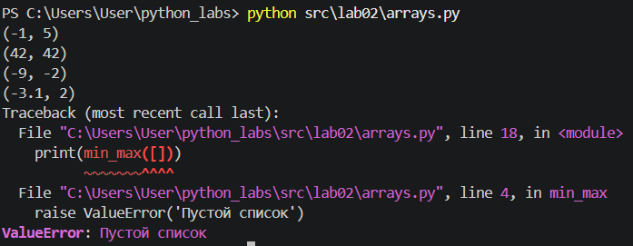
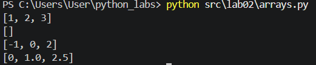
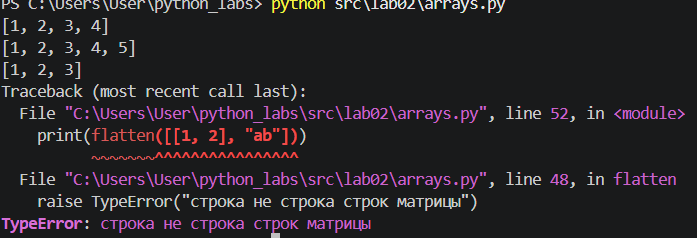
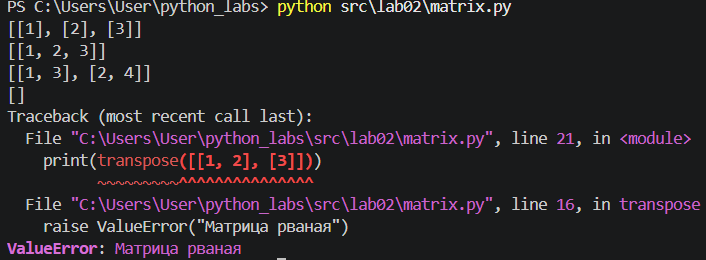
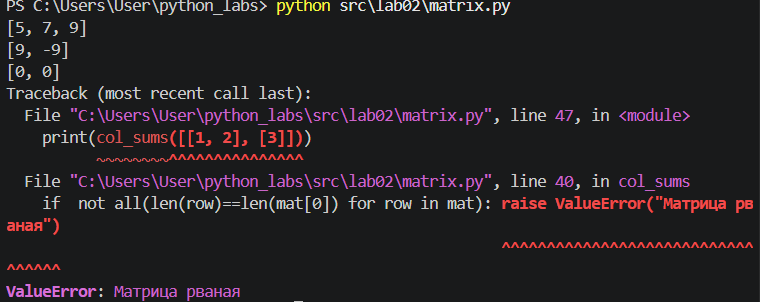
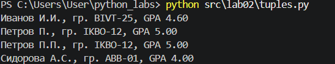

# ЛР1 - Коллекции и матрицы(list/tuple/set/dict)

## Задание 1 - arrays.py

### 1. min_max

#### Пример
```
print(min_max([3, -1, 5, 5, 0]))
print(min_max([42]))
print(min_max([-5, -2, -9]))
print(min_max([1.5, 2, 2.0, -3.1]))
print(min_max([]))
```


### 2. unique_sorted

#### Пример
```
print(unique_sorted([3, 1, 2, 1, 3]))
print(unique_sorted([]))
print(unique_sorted([-1, -1, 0, 2, 2]))
print(unique_sorted([1.0, 1, 2.5, 2.5, 0]))
```


### 3.flatten

#### Пример
```
print(flatten([[1, 2], (3, 4, 5)]))
print(flatten([[1], [], [2, 3]]))
print(flatten([[1, 2], "ab"]))
```



## Задание B - matrix

### 1. transpose

#### пример 
```
print(transpose([[1, 2, 3]]))          
print(transpose([[1], [2], [3]]))      
print(transpose([[1, 2], [3, 4]]))     
print(transpose([]))                    
print(transpose([[1, 2], [3]]))
```


### 2. row_sums

#### пример 
```
print(row_sums([[1, 2, 3], [4, 5, 6]]))     
print(row_sums([[-1, 1], [10, -10]]))        
print(row_sums([[0, 0], [0, 0]]))            
print(row_sums([[1, 2], [3]]))
```


### 3. col_sums

#### пример 
```
print(col_sums([[1, 2, 3], [4, 5, 6]]))     
print(col_sums([[-1, 1], [10, -10]]))        
print(col_sums([[0, 0], [0, 0]]))            
print(col_sums([[1, 2], [3]]))         
```



## Задание C - tuples.py

#### пример 
```markdown
```
print(format_record(("Иванов Иван Иванович", "BIVT-25", 4.6)))  
print(format_record(("Петров Петр ", "IKBO-12", 5.0)))  
print(format_record(("Петров Пётр Петрович", "IKBO-12" , 5.0)))  
print(format_record(("  сидорова  анна  сергеевна ", "ABB-01", 3.9999)))  
```


