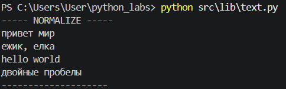
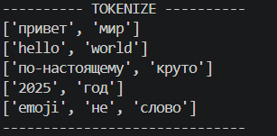
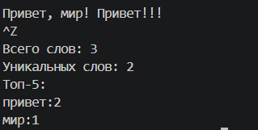

# ЛР3 - Тексты и частоты слов (словарь/множество)
## Задание А - Модуль text.py

### Код src/lib/text.py:
```python
import re
def normalize(text: str, *, casefold: bool = True, yo2e: bool = True, strip: bool = True) -> str:
    if casefold == True:
        text = text.casefold()
    else:
        text = text.lower()
    if yo2e == True: text = text.replace('ё', 'е').replace('Ё','Е')
    if '\t' in text or '\n' in text or '\r' in text:
        text = text.replace('\t',' ').replace('\r',' ').replace('\n',' ')
    text = re.sub(r'\s+', ' ', text)
    if strip == True: text = text.strip()
    return text
k = '-' 
print(k * 5, 'NORMALIZE', k * 5)
print(normalize('ПрИвЕт\nМИр\t'))
print(normalize('ёжик, Ёлка'))
print(normalize('Hello\r\nWorld'))
print(normalize('  двойные  пробелы  '))
print(k*20)

def tokenize(text: str) -> list[str]:
    text = normalize(text)
    tokens = re.findall(r'\w+(?:-\w+)*', text)
    return tokens
print(k * 10, 'TOKENIZE', k * 10)
print(tokenize('привет мир'))
print(tokenize('hello,world!!!'))
print(tokenize('по-настоящему круто'))
print(tokenize('2025 год'))
print(tokenize('emoji 😀 не слово'))
print(k*30)

def count_freq(tokens: list[str]) -> dict[str, int]:
    freq = {}
    for token in tokens:
        if token in freq:
            freq[token] += 1
        else:
            freq[token] = 1
    return freq
def top_n(freq: dict[str, int], n: int = 5) -> list[tuple[str, int]]:
    sort_freq = sorted(freq.items(), key=lambda x: x[1], reverse=True)
    return sort_freq[:n]
print(k * 15, 'COUNT_FREQ + TOP_N', k * 15)
print(count_freq(['a','b','a','c','b','a']), '+', top_n(count_freq(['a','b','a','c','b','a']), n=2))
print(count_freq(['bb','aa','bb','aa','cc']), '+', top_n(count_freq(['bb','aa','bb','aa','cc']), n=2))
print(k*54)
```

#### Проверка normalize:
```python
print(normalize('ПрИвЕт\nМИр\t'))
print(normalize('ёжик, Ёлка'))
print(normalize('Hello\r\nWorld'))
print(normalize('  двойные  пробелы  '))
```
##### Результат:



#### Проверка tokenize:
```python
print(tokenize('привет мир'))
print(tokenize('hello,world!!!'))
print(tokenize('по-настоящему круто'))
print(tokenize('2025 год'))
print(tokenize('emoji 😀 не слово'))
```

##### Результат:



#### Проверка count_freq() и top_n():
```python
print(count_freq(['a','b','a','c','b','a']), '+', top_n(count_freq(['a','b','a','c','b','a']), n=2))
print(count_freq(['bb','aa','bb','aa','cc']), '+', top_n(count_freq(['bb','aa','bb','aa','cc']), n=2))
```

##### Результат:


## Задание В - text_stats.py
#### Скрипт читает текст из stdin (весь ввод, до EOF), нормализует и токенизирует его с помощью функций из src/lib/text.py, считает общее количество слов, количество уникальных слов и выводит топ-5 самых частых слов в формате слово:количество. 
### Код src/lab03/text_stats.py:
```python
from src.lib.text import normalize, tokenize, count_freq, top_n
import sys
def main() -> None:
    a = sys.stdin.read()

    norm = normalize(a)
    tokens = tokenize(norm)
    freq = count_freq(tokens)
    totalwords = len(tokens)
    uniqewords = len(freq)

    print(f'Всего слов: {totalwords}')
    print(f'Уникальных слов: {uniqewords}')
    print('Топ-5:')
    for word, count in top_n(freq, 5):
        print(f'{word}: {count}')

if __name__ == '__main__':
    main()
```

#### Результат:



### Способы запуска text_stats.py
### 1. Запуск выполняется из корня репозитория (там, где лежит папка src/), с помощью флага -m:
```
python -m src.lab03.text_stats
```

#### Терминал «зависает» на пустой строке и ждёт ввода. Можно:
##### • напечатать текст с клавиатуры и/или вставить его (Ctrl+V);
##### • нажать Enter, чтобы перейти на новую строку (можно ввести несколько строк).
#### Чтобы завершить ввод (сигнал EOF) и запустить обработку:
##### • Windows / PowerShell: Ctrl+Z, затем Enter;
##### • Linux / macOS: Ctrl+D.

### 2. Через echo (быстрая проверка одной строкой):
```
echo "Привет, мир! Привет!!!" | python -m src.lab03.text_stats
```
